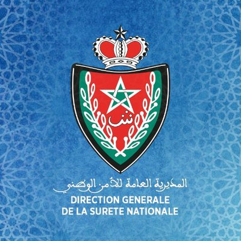

**A Rising Threat**:
The increased power of computers and the adoption of artificial intelligence provide cyber attackers with sufficient means to launch more sophisticated and 
destructive attacks. Reactive defenses are no longer sufficient to thwart the infiltration of the most secure architectures. Environmental dynamics are 
constantly changing and disrupting resilience with the rapid adoption of cloud infrastructure and the proliferation of IOT devices.
The concept of security measures as we know it is changing, and the fight against cybercrime has migrated within the network. 
In the face of these changes, the footprint of the threat is greater than before. Organizations need to rethink their security strategies as well as the tools 
they traditionally rely on.

**CyberSecurity Governance**:

The future of information systems security in Morocco was decided this recent years. His Majesty King Mohammed VI, may God glorify him, upon his enthronement, 
has instilled a dynamic of modernization of Moroccan institutions. It is from this dynamic and to further improve the security of information systems in Morocco 
that His Majesty King Mohamed VI encouraged the establishment of new instructions aimed at increasing the preventive 
capacity of our country in order to ensure the protection of the information systems of sensitive organizations. 
Through this new initiative, the sensitive organizations of the country intends to be at the forefront of modernity to meet the challenges and face the latest threats of 
cybercrime with more efficiency. 

**DGSN Fighting Cybercrime**:

Cybercrime is now in complete expansion, criminals are increasingly attracted to the hook of cyber space and have begun to commit crimes since the latter, 
hidden behind a feeling of anonymity and impunity cyber criminals are doing great damage, though moral, financial and physical.
###Cybercrime is all types of ICT-related crimes or crimes:
- All types of Intrusions and Attacks on information systems
- Traditional crimes facilitated by the use of ICTs, such as extortion, identity theft, defamation, fraud, cyber-terrorism ...

Conscious of the scale of this new criminal arsenal, the DGSN has set up several Cybernetic Investigation Units to counter cybercrime and please the security of the Kingdom’s cyber space and the security of the Moroccan Internet user.
